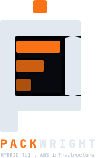
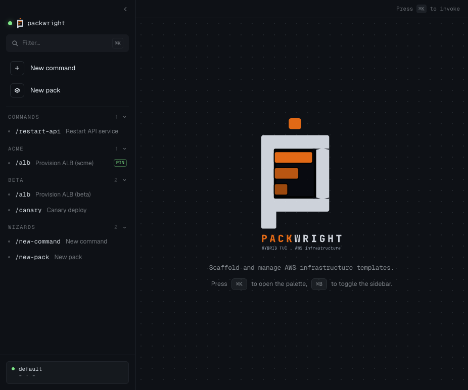
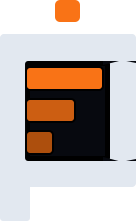

<p align="center">
  
</p>

<h3 align="center">
  Two faces. One binary. Your AWS manifests, in a terminal or a window.
</h3>

<p align="center">
  <a href="go.mod"></a>
  <a href="LICENSE"></a>
  <a href="#status"></a>
</p>

---

**Packwright** scaffolds and runs your AWS infrastructure templates. One
binary, two front-ends — a Bubble Tea TUI by default, a Wails + Svelte
GUI with `--gui`. Both read the same manifests on disk and refresh live
when you edit them.

## Install

```bash
git clone https://github.com/bannaarr01/packwright.git
cd packwright
go build -o packwright .                # TUI-only
wails build -skipbindings               # full TUI + GUI app bundle
```

## Use

```bash
packwright                                                       # terminal UI
./build/bin/packwright.app/Contents/MacOS/packwright --gui       # graphical UI
```

Open the command palette with <kbd>⌘K</kbd> (macOS) or
<kbd>Ctrl+K</kbd>. Toggle the sidebar with <kbd>⌘B</kbd>.

<p align="center">
  
</p>

### Add a command

Drop a YAML manifest into `~/.config/packwright/commands/` (or any
`packs/<name>/manifests/` directory under the same home). The palette and
sidebar pick it up within ~150 ms — no restart.

```yaml
# ~/.config/packwright/commands/restart-api.yaml
schema_version: packwright.manifest.v1
kind: shell
slash: /restart-api
title: Restart API service
```

Supported kinds: `shell`, `resource`, `monitor`, `composite`. Conflicting
slashes across packs render with a `(pack-name)` suffix; pin a default
in `~/.config/packwright/config.yaml`:

```yaml
defaults:
  /alb: pack:acme
```

## Contributing

Read [AGENTS.md](AGENTS.md) first — it covers conventions, the front-end
registry pattern, quality gates (`gofmt`, `go vet`, `go test`,
`npm run check`), the Husky hooks, and the Playwright MCP workflow for
GUI testing.

<p align="center">
  
  <br>
  <sub>Apache-2.0</sub>
</p>
